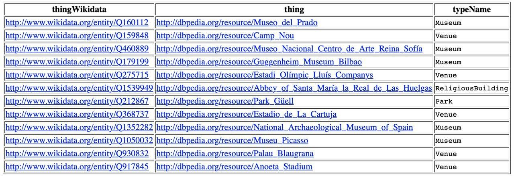
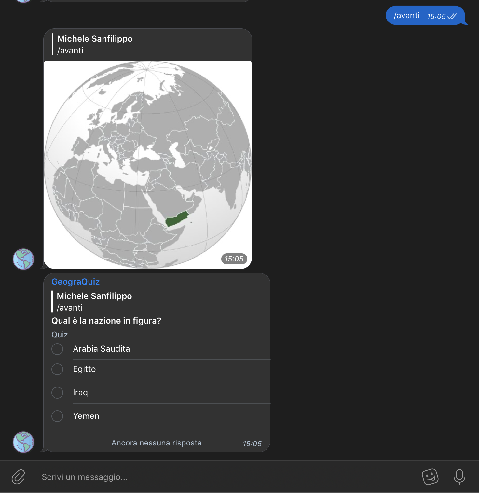
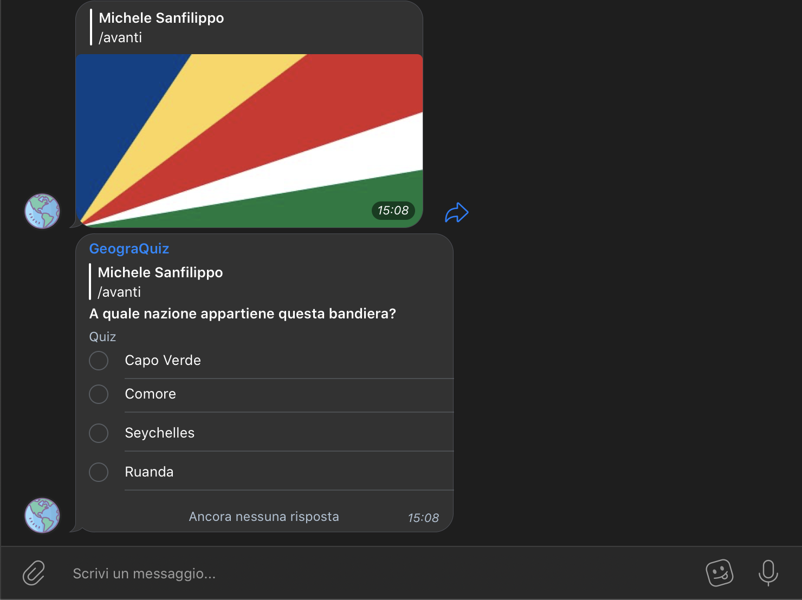
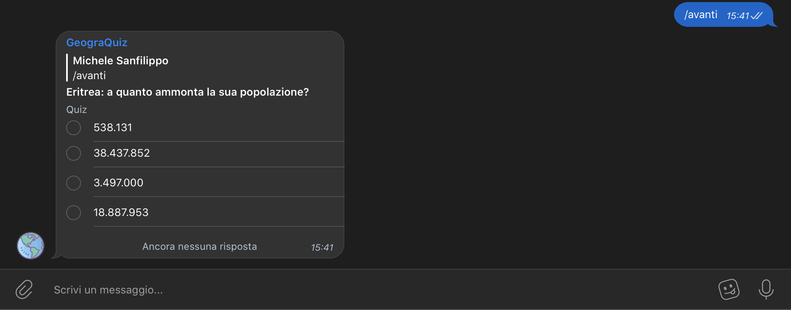
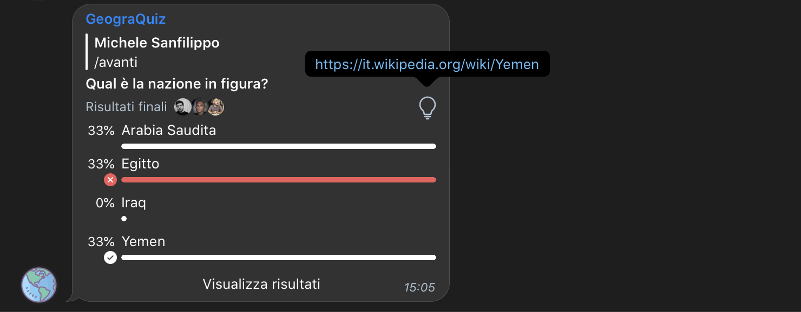

<p style="font-size:40px;text-align:center;font-weight:bold">GeograQuiz</p>
<p style="font-size:20px;text-align:center;font-weight:bold">Tecniche per la Gestione degli Open Data A.A 2019/2020</p>

<p align="right">Davide Avellone, matricola: 0670611 <br> Michele Sanfilippo, matricola: 0664184 <br> Giuseppe Marino, matricola: 0664577</p>

[TOC]

 contenente dati sulle nazioni del mondo sulla base delle informazioni ottenute attraverso Wikidata e DBpedia

## Introduzione

Il progetto ha come obiettivo lo sviluppo di un bot Telegram in Python, che lavora con un dataset da noi ricavato, per creare in automatico dei quiz geografici ai quali partecipare in compagnia con i propri amici dentro delle chat di gruppo. 

Le basi di conoscenza coinvolte per realizzare il nostro dataset sono state Wikidata e DBpedia. Nello specifico Wikidata è stata la fonte principale, dalla quale abbiamo estrapolato informazioni ed immagini, mentre DBpedia è stata importante per ottenere, partendo da una nazione, un insieme di *correlati*, in altri termini delle nazioni affini, che potessero essere utilizzate come possibili risposte al quiz.

Wikidata mette a disposizione i propri dati con licenza CC0, mentre DBpedia con licenza CC-BY-SA ShareAlike 3.0. Quindi i dati utilizzati da Wikidata sono compatibili con qualsiasi altra licenza, mentre quelli di DBpedia soltanto con licenze CC-BY-SA, motivo per cui il nostro dataset sarà rilasciato con una licenza di tipo CC-BY-SA per mantenere la compatibilità.

## Dataset

Il dataset è stato realizzato da noi attraverso degli script Python che utilizzano delle query in formato SPARQL, grazie alla libreria SPARQLWrapper, per accedere agli endpoint di Wikidata e DBpedia, rispettivamente `https://query.wikidata.org/sparql` e `https://dbpedia.org/sparql`. Nello specifico abbiamo sfruttato questi endpoint per ottenere le informazioni riguardanti gli stati sovrani del mondo (quindi sono stati esclusi gli ex stati e gli stati non universalmente riconosciuti). Le etichette sono state estratte in italiano, anche se si è pensato di predisporre in futuro dei dataset localizzati in più lingue.

Le informazioni estratte sono:

+ la capitale: sia come URI Wikidata che come label
+ la bandiera: come risorsa SVG su Wikidata
+ la popolazione: come valore intero
+ la superficie: come valore intero
+ il codice unicode: emoji della bandiera relativa
+ delle mappe: come risorse SVG su Wikidata
+ la pagina Wikipedia: come collegamento alla voce Wikipedia
+ i paesi correlati: come URI WIkidata

I Paesi sono stati ottenuti ordinati sulla base del loro `linkcount`. Questo permette di determinare l'importanza di una voce su Wikidata. L'idea iniziale dietro a questo ordinamento era quella di attribuire un moltiplicatore diverso alle varie nazioni, facendo pesare di meno le risposte relative ai paesi più conosciuti, e di più le risposte per i Paesi meno conosciuti. Dalle nostre prove sono sorti dei problemi, per esempio Il Regno dei Paesi Bassi risulta essere all'ultimo posto, in quanto buona parte delle voci che permetterebbero di collocarlo nelle parti più alte della classifica, sono direttamente collegate ai Paesi Bassi, ossia una delle quattro nazioni costitutive del Regno (Insieme a Aruba, Curaçao e Sint Maarten). Onde evitare problematiche di questo tipo abbiamo deciso di dare a tutte le nazioni lo stesso peso.


La query per fare ciò, utilizzata dentro il il file `connection.py`, risulta essere la seguente:

```SPARQL
SELECT ?country ?countryLabel ?capital ?capitalLabel ?flag ?population ?surface ?unicode ?maps ?articleLabel

WHERE
{
 \# per includere gli stati sovrani
 ?country wdt:P31 wd:Q3624078 .
 \# per escludere le ex nazioni
 FILTER NOT EXISTS {?country wdt:P31 wd:Q3024240}
 \# per escludere gli stati dei popoli antichi
 FILTER NOT EXISTS {?country wdt:P31 wd:Q28171280}
  ?country wdt:P36 ?capital .
  ?country wdt:P41 ?flag .
  ?country wdt:P1082 ?population .
  ?country wdt:P2046 ?surface .
  ?country wdt:P487 ?unicode .
  ?country wdt:P242 ?maps .
  ?country wikibase:sitelinks ?linkcount . 
  ?article schema:about ?country .
  ?article schema:isPartOf <https://it.wikipedia.org/> .
 SERVICE wikibase:label { bd:serviceParam wikibase:language "it" }
} ORDER BY DESC(?linkcount)
```

A questo punto siamo in possesso delle nazioni con le loro proprietà. Come già accennato, al fine di ottenere delle alternative coerenti con le risposte corrette dei quiz siamo interessati ad ottenere una lista di nazioni per ogni elemento precedentemente ricavato. Con correlati intendiamo quelle nazioni che più sono simili alla nazione soggetto del quiz. Ad esempio per una domanda che ha come risposta corretta l'Italia vogliamo che le alternative siano "prossime" dal punto di vista concettuale all'Italia (ad esempio la Spagna, la Francia... piuttosto che il Congo, la Corea del Nord...). Si fa notare che non si tratta di semplice vicinanza geografica (per esempio l'Australia è correlata sia a nazioni come la Nuova Zelanda che al Regno Unito).

Per riuscire in ciò abbiamo valutato varie opzioni. Ad esempio abbiamo provato ad estrapolare i correlati come nazioni che condividono molte proprietà rispetto alla nazione considerata su Wikidata, ma questo approccio forniva risultati poco coerenti, infatti nazioni come gli Stati Uniti, Regno Unito e la Corea del Nord risultavano tra i primi risultati quasi sempre. Altro esempio è dato dall'India che risultava essere la seconda nazione più correlata all'Italia.

I risultati migliori sono stati ottenuti ordinando sulla base delle proprietà comuni tra le nazioni in DBpedia, probabilmente le rappresentazioni su questa base di conoscenza sono più affini a quello che noi tendiamo a notare come correlazione importante.  

Il primo passaggio è stato quello di ricavare l'entità corrispondente su DBpedia, sulla base dell'URI Wikidata, per fortuna i dati sono collegati tra le due basi ed il passaggio è risultato molto agevole. Una volta ottenuta la lista degli URI Wikidata ordinata per grado di correlazione, abbiamo estratto solo i primi otto risultati.

La query per fare ciò, utilizzata dentro il il file `connection.py`, risulta essere la seguente:

```SPARQL
SELECT ?countryWikidata
WHERE
{{
?key owl:sameAs {0}.
?key ?p ?o .
?country rdf:type dbo:Country ;
?p ?o .
?country owl:sameAs ?countryWikidata .
FILTER(strstarts(str(?countryWikidata),str(wikidata:))).
FILTER (?country != ?key).
}} GROUP BY ?countryWikidata
ORDER BY DESC(COUNT(?p))
LIMIT 8
```

**Nota bene**: la query rappresentata è formattata in modo da essere processata in Python, infatti verrà eseguita una volta per nazione, tramite `sparql.setQuery(query.format("<" + result["country"] + ">"))`, per cui di volta in volta `{0}` verrà sostituito con l'URI Wikidata della nazione.


In un primo momento era stato pensato di fornire, per ogni nazione, anche un insieme di persone famose, e un insieme di posti, edifici e monumenti importanti. Tuttavia questa opzione è stata esclusa, senza ulteriori affinamenti avrebbe reso il gioco troppo difficile, infatti per le nazioni meno famose questi risultati erano praticamente sconosciuti. Si era pensato di includerli proporzionalmente all'importanza della nazione, ma per gli stessi motivi legati al punteggio, questa opzione è stata esclusa (ad esempio pur essendo Van Gogh uno dei pittori più famosi della storia, sarebbe stato escluso perché appartenente al Regno dei Paesi Bassi).

Qui di seguito le query proposte, ma non implementate. Si fa notare che per ottenere le varie entità ordinate per importanza abbiamo utilizzato sia il servizio di Page Rank su DBpedia che i linkcount su Wikidata.

```SPARQL
#CALCIATORI FAMOSI
PREFIX vrank:<http://purl.org/voc/vrank#>
SELECT ?footballer ?rank
FROM <http://dbpedia.org>
FROM <http://people.aifb.kit.edu/ath/#DBpedia_PageRank>
WHERE {
?footballer rdf:type dbo:Athlete, dbo:Person; <http://purl.org/linguistics/gold/hypernym> dbr:Footballer . 
?footballer vrank:hasRank ?r .
?r vrank:rankValue ?rank .
} ORDER by DESC(?rank)
```

```SPARQL
#ATTORI
SELECT DISTINCT ?actor ?country WHERE {
  ?actor wdt:P31 wd:Q5;
    wdt:P106/wdt:P279* wd:Q10800557;
    wdt:P27 ?country;
    wikibase:sitelinks ?linkcount.
  MINUS{
    {?actor wdt:P106/wdt:P279* wd:Q639669.} UNION { ?actor wdt:P106/wdt:P279* wd:Q36180.}
    }
  SERVICE wikibase:label { bd:serviceParam wikibase:language "en". }
}
ORDER BY DESC (?linkcount)
LIMIT 200
# il MINUS per escludere quei musicisti e scrittori che erano apparsi in qualche film
```


```SPARQL
#SCIENZIATI
SELECT DISTINCT ?scientist ?country WHERE {
  ?scientist wdt:P31 wd:Q5;
    wdt:P106/wdt:P279* wd:Q901;
    wdt:P27 ?country;
    wikibase:sitelinks ?linkcount.
  SERVICE wikibase:label { bd:serviceParam wikibase:language "en". }
}
ORDER BY DESC (?linkcount)
LIMIT 200
```

```SPARQL
#LUOGHI DI INTERESSE
PREFIX vrank:<http://purl.org/voc/vrank#>
select ?thingWikidata ?thing ?typeName
FROM <http://people.aifb.kit.edu/ath/#DBpedia_PageRank>
where {
VALUES ?country {<http://dbpedia.org/resource/Spain>}
?thing dbo:location ?country.
?thing owl:sameAs ?thingWikidata .
?thing vrank:hasRank ?r .
?r vrank:rankValue ?rank .
FILTER(strstarts(str(?thingWikidata),str(wikidata:))).
optional
{
?thing a ?type.
VALUES ?type {dbo:NaturalPlace}
BIND( "NaturalPlace" as ?typeName )
}
optional
{
?thing a ?type.
VALUES ?type {dbo:Venue}
BIND( "Venue" as ?typeName )
}
optional
{
?thing a ?type.
VALUES ?type {dbo:Museum}
BIND( "Museum" as ?typeName )
}
optional
{
?thing a ?type.
VALUES ?type {dbo:Pyramid}
BIND( "Pyramid" as ?typeName )
}
optional
{
?thing a ?type.
VALUES ?type {yago:Skyscraper104233124}
BIND( "Skyscraper" as ?typeName )
}
optional
{
?thing a ?type.
VALUES ?type {dbo:Park}
BIND( "Park" as ?typeName )
}
optional
{
?thing a ?type.
VALUES ?type {dbo:ReligiousBuilding}
BIND( "ReligiousBuilding" as ?typeName )
}
{
?thing a dbo:Place
}
filter (BOUND (?type))
} ORDER by DESC(?rank) LIMIT 12
```

L'output della query è il seguente:



Non abbiamo utilizzato i risultati nel nostro dataset poiché avendo 195 paesi nel caso in cui venga estratto un paese poco conosciuto (il che è molto probabile, perché di questi 195 paesi quelli molto noti dalla media sono una minima parte) non si è in grado di associare il luogo di interesse al paese corretto.

## Pipeline di elaborazione

Abbiamo elaborato i dati ottenuti dalle query attraverso degli script in Python, in modo da ottenere dei file JSON utilizzabili dal bot come base di conoscenza. In particolare abbiamo agito sulle mappe e sui correlati di ogni paese. 

Per quanto riguarda le mappe, per alcuni paesi, Wikidata ci forniva più di una mappa e questo creava dei conflitti in quanto il paese veniva riconosciuto più volte dato che le informazioni differivano per la mappa, e quindi venivano riconosciuti come paesi diversi. Pertanto abbiamo realizzato uno script che ci ha permesso di raggruppare le mappe differenti per un paese in una lista per la stessa entità piuttosto che per più entità diverse.

```python
#SCRIPT MAPPE
maps_array = []
final_results = []
maps_array.append(results["results"]["bindings"][0]["maps"]["value"])
for i in range(1, len(results["results"]["bindings"])):
  r1 = results["results"]["bindings"][i-1]
  r2 = results["results"]["bindings"][i]
  if r1["country"]["value"] == r2["country"]["value"]:
    maps_array.append(r2["maps"]["value"])
  else:
    r1["maps"]["value"] = maps_array
    final_results.append(r1)
    maps_array = [r2["maps"]["value"]]

results["results"]["bindings"][-1]["maps"]["value"] = maps_array
final_results.append(results["results"]["bindings"][-1])
```

 Per raggruppare le mappe di un paese in una lista accediamo ai vari campi dell'entità fino ad arrivare alla mappa, e controlliamo se il paese dell'elemento successivo a quello che stiamo analizzando è uguale, e nel caso in cui lo è aggiungiamo la mappa alla lista delle mappe di quel paese ignorando successivamente il paese da cui abbiamo preso la mappa, altrimenti continuiamo la scansione, procedendo allo stesso modo. 

Per quanto riguarda i correlati sono stati aggiunti in un secondo momento attraverso uno script, che è il seguente:

```python
#SCRIPT CORRELATI
related_array = []

for result in final_results:
  sparql.setQuery(query.format("<" + result["country"] + ">"))
  results = sparql.query().convert()
  for i in range(0, len(results["results"]["bindings"])):
    related_array.append(results["results"]["bindings"][i]["countryWikidata"]["value"])
  print(related_array)
  result["related"] = related_array
  related_array = []
```

Dato il problema precedente delle mappe, si è deciso di creare direttamente related come lista di paesi correlati, che inizialmente ne conteneva 8 per ogni paese, ma successivamente è stato necessario filtrare questa lista e riportare i paesi correlati tra i paesi presenti nel dataset. Sono quindi stati eliminati dai correlati quei paesi che risultavano essere paesi non riconosciuti o territori contesi. 

```python
countries = [c["country"] for c in data]
for i in range(len(data)):
    data[i]["related"] = [r for r in data[i]["related"] if r in countries]
```

Per aggiungere i dati di wikipedia al JSON abbiamo invece utilizzato il seguente script:
```python
for i in range(len(data)):
    print(countries[i])
    sparql.setQuery(query.format("<" + countries[i] + ">"))
    results = sparql.query().convert()
    data[i]["wikipedia"] = results["results"]["bindings"][0]["article"]["value"]
```

I dati sono stati rappresentati in formato JSON, inizialmente decorato, e successivamente elaborato in python per renderlo non decorato e ideale per l'utilizzo del nostro bot. Questa elaborazione del JSON è stata fatta nel seguente modo:

```python
#ESEMPIO JSON DECORATO
"results": {
    "bindings": [
      {
        "country": {
          "type": "uri",
          "value": "http://www.wikidata.org/entity/Q17"
        },
        "flag": {
          "type": "uri",
          "value": "http://commons.wikimedia.org/wiki/Special:FilePath/Flag%20of%20Japan.svg"
        },
        "unicode": { "type": "literal", "value": "🇯🇵" },
        "capital": {
          "type": "uri",
          "value": "http://www.wikidata.org/entity/Q1490"
        },
        "maps": {
          "type": "uri",
          "value": "http://commons.wikimedia.org/wiki/Special:FilePath/Japan%20on%20the%20globe%20%28de-facto%29%20%28Japan%20centered%29.svg"
        },
        "surface": {
          "datatype": "http://www.w3.org/2001/XMLSchema#decimal",
          "type": "literal",
          "value": "377972.28"
        },
        "population": {
          "datatype": "http://www.w3.org/2001/XMLSchema#decimal",
          "type": "literal",
          "value": "126785797"
        },
        "countryLabel": {
          "xml:lang": "it",
          "type": "literal",
          "value": "Giappone"
        },
        "capitalLabel": {
          "xml:lang": "it",
          "type": "literal",
          "value": "Tokyo"
        }
      }
```

```python
#ESEMPIO DA JSON DECORATO A NON DECORATO
for result in final_results:
  result["maps"] = result["maps"]["value"]
  result["capitalLabel"] = result["capitalLabel"]["value"]
  result["country"] = result["country"]["value"]
  result["surface"] = result["surface"]["value"]
  result["flag"] = result["flag"]["value"]
  result["unicode"] = result["unicode"]["value"]
  result["capital"] = result["capital"]["value"]
  result["population"] = result["population"]["value"]
  result["countryLabel"] = result["countryLabel"]["value"]
```

Dopo l'elaborazione in python otteniamo i dati nel seguente formato:

```python
#ESEMPIO JSON NON DECORATO
{
    "capitalLabel": "Tokyo",
    "country": "http://www.wikidata.org/entity/Q17",
    "surface": "377972.28",
    "maps": [
      "http://commons.wikimedia.org/wiki/Special:FilePath/Japan%20on%20the%20globe%20%28de-facto%29%20%28Japan%20centered%29.svg"
    ],
    "flag": "http://commons.wikimedia.org/wiki/Special:FilePath/Flag%20of%20Japan.svg",
    "related": [
      "http://www.wikidata.org/entity/Q884",
      "http://www.wikidata.org/entity/Q148",
      "http://www.wikidata.org/entity/Q30",
      "http://www.wikidata.org/entity/Q159",
      "http://www.wikidata.org/entity/Q142",
      "http://www.wikidata.org/entity/Q423"
    ],
    "unicode": "\ud83c\uddef\ud83c\uddf5",
    "capital": "http://www.wikidata.org/entity/Q1490",
    "countryLabel": "Giappone",
    "population": "126785797"
  }
```

## Bot Telegram

### Introduzione

Una volta estratte le informazioni di nostro interesse, la cosa da fare è stata predisporre un metodo agevole per generare delle domande, tenere traccia delle risposte date, e poter competere insieme ad i propri amici. A tal proposito la soluzione più rapida ed efficace è stata quella di sviluppare un bot Telegram. L'idea è stata quella di permettere al bot di inviare dei messaggi di tipo quiz all'interno dei gruppi, tenendo il conto delle risposte corrette date dai vari partecipanti. 


### Libreria

L'API di Telegram può essere utilizzata in un qualsiasi linguaggio di programmazione che supporti le richieste HTTP, in questo caso si è preferito utilizzare il linguaggio Python più la libreria [python-telegram-bot](https://github.com/python-telegram-bot/python-telegram-bot). Questa libreria si installa molto facilemnte tramite il gestore dei pacchetti Pip di Python, e fornisce un wrapper completo per tutte le funzionalità dell'API Telegram.

per l'installazione basta eseguire da riga di comando: `pip install python-telegram-bot --upgrade`


### Funzionamento


Qui di seguito le variabili globali utili alla comprensione degli snippet di codice:

+ `sessions = {}` tiene conto delle sessioni di gioco
+ `options_number = 3` rappresenta il numero di opzioni, oltre la corretta, presenti nelle domande
+ `countries = None` conterrà il dataset una volta caricato il dataset 
+ `countries_count = 0` conterrà il numero di nazioni dentro il dataset
+ `index_for_uri = {}`  una volta caricato il dataset conterrà l'indice per un URI, tornerà utile per accedere usando l'URI della nazione come chiave
+ `quiz_types = 4` rappresenta il numero di domande che sono state implementate
+ `rounds_count = 10` rappresenta il numero di round per un quiz

Il dataset viene caricato ancora prima di istanziare il bot:

```python
with open('./data.json') as input:
    countries = json.load(input)
    countries_count = len(countries)
    i = 0
    for country in countries:
        index_for_uri[country['country']] = i
        i += 1
```

Il bot di fatto viene aggiunto al gruppo come fosse un normale utente, e l'interazione con esso avviene tramite i cosiddetti *comandi*, altro non sono che semplici parole chiave antecedute da uno *slash* che vengono intercettate dal bot non appena si invia un messaggio che le contiene. Inoltre questi comandi vengono resi accessibili tramite un pannello predisposto che rende l'interazione ancora più pratica. 

Il bot può mantenere una sessione di gioco per ogni gruppo, per ogni sessione ha una lista dei partecipanti con i relativi punteggi, questa è memorizzata dentro il dizionario `session`. All'avvio del bot esso stampa un messaggio di aiuto contenente una descrizione di tutti i comandi e la sua modalità di funzionamento.

Di seguito la dichiarazione e l'assegnazione del bot e dei suoi handler:

```python
updater = Updater(
    '<TOKEN>', use_context=True)

dispatcher = updater.dispatcher
dispatcher.add_handler(CommandHandler('start', help_handler))
dispatcher.add_handler(CommandHandler('aiuto', help_handler))
dispatcher.add_handler(CommandHandler('nuovo', new_handler))
dispatcher.add_handler(CommandHandler('avanti', next_question_handler))
dispatcher.add_handler(CommandHandler('avvia', start_handler))
dispatcher.add_handler(CommandHandler('partecipo', taking_part_handler))
dispatcher.add_handler(CommandHandler('termina', stop_handler))
dispatcher.add_handler(PollAnswerHandler(receive_question_answer))
updater.start_polling()
updater.idle()
```


Il primo passo per creare un quiz è quello di dare il comando `/nuovo`, così facendo si innesca l'handler `new_handler`, esso nel caso in cui il comando sia stato lanciato in una chat adeguata, aggiunge la chat alla sessione, inizializzando il conteggio dei round residui a `rounds_left: rounds_count`, lo stato del quiz come `is_started: False` e la possibilità di richiedere le domande come `can_request: False`. Questo perché a questo punto il bot è in attesa che gli utenti diano la loro patecipazione.

```python
def new_handler(update, context):

    chat_id = update.message.chat.id
    if chat_id in sessions:
        update.message.reply_text(
            'C \'è già un quiz in corso\n\n digita 👉 /termina per terminarlo')
    elif update.message.chat.type == 'group':
        # mettere numero round variabile
        sessions[chat_id] = {'participants': {}, 'usernames': {},
                             'is_started': False, 'can_request': False, 'rounds_left': rounds_count}
        update.message.reply_text(
            'Digita\n\n👉 /partecipo per prendere parte al quiz\n\n👉 /avvia quando siete pronti per avviare il quiz')
    else:
        update.message.reply_text(
            'Questo bot è pensato per i gruppi, aggiungilo ad un gruppo @GeograQuizBot')
```


Per prendere parte al gioco, gli utenti del gruppo devono dare il comando `/partecipo`. Si fa notare che si è preferito definire esplicitamente i partecipanti piuttosto che rendere il quiz aperto direttamente a tutto il gruppo per poter bloccare l'invio di domande successive fino a che tutti gli effettivi interessati al quiz avranno risposto. Una volta che l'utente sarà stato aggiunto alla partita il suo contatore di risposte corrette verrà posto a zero `sessions[chat_id]['participants'][user_id] = 0`.

```

def taking_part_handler(update, context):
    chat_id = update.message.chat.id
    user_id = update.message.from_user.id
    if chat_id in sessions:
        if sessions[chat_id]['is_started']:
            update.message.reply_text(
                'Non puoi prendere parte ad un quiz già iniziato! 😢')
        elif user_id not in sessions[chat_id]['participants']:
            sessions[chat_id]['participants'][user_id] = 0
            sessions[chat_id]['usernames'][user_id] = update.message.from_user.username
        else:
            update.message.reply_text('Sei già un partecipante! 😎')
    else:
        if update.message.chat.type == 'group':
            update.message.reply_text(
                'Digita 👉 /nuovo per avviare un nuovo quiz!')
        else:
            update.message.reply_text(
                'Questo bot è pensato per i gruppi, aggiungilo ad un gruppo @GeograQuizBot')

```


Una volta stabilita la lista dei partecipanti si può procedere al quiz tramite il comando `/avvia` . Questo di fatto imposta per la partita sessions `[chat_id]['is_started'] = True` e `sessions[chat_id]['can_request'] = True` mettendo il bot in attesa del comando `/avanti`. Affinché si possa avviare il gioco sono richiesti almeno due partecipanti, se così non fosse il bot invierà un messaggio informativo.

```python

def start_handler(update, context):
    chat_id = update.message.chat.id
    if chat_id in sessions:
        if sessions[chat_id]['is_started']:
            update.message.reply_text('Il quiz è già avviato 😎')
        else:
            if len(sessions[chat_id]['participants']) > 1:
                sessions[chat_id]['is_started'] = True
                sessions[chat_id]['can_request'] = True
                update.message.reply_text(
                    'Digita 👉 /avanti per la prossima domanda')
            else:
                update.message.reply_text(
                    'Servono almeno due partecipanti, Digita\n\n👉 /partecipo per prendere parte al quiz')

    else:
        update.message.reply_text(
            'Digita 👉 /nuovo per creare un nuovo quiz prima di avviarlo')

```

Per richiedere la nuova domanda, come già detto, è necessario che tutti i partecipanti al quiz abbiano comunicato la loro risposta, o che comunque lo stato sia in `sessions[chat_id]['can_request'] = True`. A questo punto lo stato passa in `sessions[chat_id]['can_request'] = False`, e viene preparata ed inviata la domanda. 

Di volta in volta il contenuto viene ricavato partendo da una tra le quattro funzioni per la generazione di domande, scelta a caso. I valori restituiti dalle le funzioni sono coerenti tra di loro, e prevedono un testo, delle risposte, l'indice della risposta corretta ed, eventualmente, una immagine. La produzione delle domande verrà approfondita in seguito.

```python
def next_question_handler(update, context):
    chat_id = update.message.chat.id
    user_id = update.message.from_user.id
    if chat_id not in sessions:
        update.message.reply_text(
            'Digita 👉 /nuovo per avviare un nuovo quiz!')
    else:
        session = sessions[chat_id]
        if user_id not in session['participants']:
            update.message.reply_text(
                'Digita 👉 /avanti per la prossima domanda')
        elif not session['is_started']:
            update.message.reply_text(
                'Digita 👉 /avanti per avviare un nuovo quiz')
        elif not session['can_request']:
            update.message.reply_text(
                'Dovete dare tutti una risposta prima di procedere alla prossima domanda! 😉')
        else:
            session['can_request'] = False
            quiz_type = random.randrange(quiz_types)

            questions = [population_question,
                         country_for_capital_question,
                         map_question,
                         flag_question]

            result = random.choice(questions)()

            if result['image'] is not None:
                update.effective_message.reply_photo(svg2png(result['image']))

            message = update.effective_message.reply_poll(result['title'],
                                                          result['options'],
                                                          type=Poll.QUIZ,
                                                          is_anonymous=False,
                                                          explanation=result['explanation'],
                                                          correct_option_id=result['correct'])

            # Save some info about the poll the bot_data for later use in receive_quiz_answer
            payload = {
                message.poll.id: {
                    'chat_id':
                    update.effective_chat.id,
                    'message_id':
                    message.message_id,
                    'correct_option_id': result['correct'],
                    'current_answers': 0
                }
            }
            context.bot_data.update(payload)
```

È possibile annullare la partita in corso in un suo punto qualsiasi digitando `/termina`. Questo comando rimuove direttamente la sessione per la chat all'interno della quale è chiamato.

```python
def stop_handler(update, context):

    chat_id = update.message.chat.id
    if chat_id in sessions:
        del sessions[chat_id]
        update.message.reply_text('Quiz cancellato 😢')
    else:
        update.message.reply_text('Non c\'è nessun quiz in corso 🤔')
```

Una volta terminati i round viene stampata la classifica dei partecipanti, con i relativi punteggi.


### Generazione delle domande

Come già anticipato, sono state implementate quattro possibili tipi di domanda:

+ Popolazione: data una nazione, a quanto ammonta la sua popolazione?
+ Bandiera: data l'immagine di una bandiera, a quale nazione appartiene?
+ Capitale: dato il nome di una capitale, a quale nazione appartiene?
+ Mappa: data l'immagine di una mappa con un territorio evidenziato, di che nazione si tratta?

Il testo della domanda, e l'eventuale immagine, vengono ricavati partendo da una delle nazioni del nostro dataset, estratta a caso.

Per ciascuna di queste domande sono fornite quattro possibili alternative, di cui, naturalmente, solo una è corretta.

Nel caso della popolazione, le alternative sono dei valori numerici generati a caso, predisposti in modo tale da discostarsi abbastanza dal valore vero, pur restando all'interno di un intervallo verosimile, così da poter permettere di rispondere senza sapere la cifra con esattezza.

Per tutte le altre alternative vengono forniti dei nomi di nazione ricavati tramite i `related` della nazione della risposta esatta, estraendone tre a caso dall'insieme.

Quiz sulle mappe geografiche:

Quiz sulle bandiere:

Quiz sulla popolazione:


Telegram permette di impostare una *spiegazione* per ogni domanda del quiz, in un primo momento avevamo pensato di aggiungere la descrizione dell'about di dbpedia per la nazione della risposta corretta, purtroppo il limite nel numero dei caratteri della spiegazione ci ha costretti ad una soluzione più antiestetica, ma anche più funzionale, cioè il link a Wikipedia.




Già dal nostro dataset, estratto così com'è, si potrebbero pensare delle altre possibili domande. Ad esempio per ogni nazione abbiamo il codice unicode relativo all'emoji della propria bandiera, quindi si potrebbe pensare ad una domanda del tipo *Per il nome di una nazione, qual è la sua bandiera?*. Tuttavia abbiamo preferito escluderla perché da una emoji troppo piccola sarebbe stato difficile cogliere le differenze tra bandiere simili come quelle dell'Honduras, Nicaragua ed El Salvador, che di fatto capitano spesso come correlati.

```python
def question_data():
    country = countries[random.randrange(countries_count)]
    options = random_elems(country['related'], options_number)
    options.append(country['country'])
    random.shuffle(options)
    correct_index = options.index(country['country'])
    options = [get_country_label(o) for o in options]
    return (country, options, correct_index)


def map_question():

    (country, options, correct_index) = question_data()
    return {
        'title': 'Qual è la nazione in figura?',
        'options': options,
        'correct': correct_index,
        'explanation': country['wikipedia'],
        'image': random.choice(country['maps'])
    }


def population_question():
    (country, options, correct_index) = question_data()
    population = int(country['population'])
    options = [population]
    for i in range(options_number):
        x = random.randrange(4)
        if (x == 0):
            x = 5
        elif (x == 1):
            x = 1 / 5
        elif (x == 2):
            x = 8
        elif (x == 3):
            x = 1 / 8
        option = round((population + population * (random.random() - 0.5)) * x)
        options.append(option)
    random.shuffle(options)
    correct_index = options.index(population)
    options = ['{:,}'.format(o).replace(',', '.') for o in options]

    return {
        'title': country['countryLabel'] + ': a quanto ammonta la sua popolazione?',
        'options': options,
        'correct': correct_index,
        'explanation': country['wikipedia'],
        'image': None
    }


def country_for_capital_question():
    (country, options, correct_index) = question_data()
    return {
        'title': country['capitalLabel'] + ' è la capitale di quale tra le seguenti nazioni?',
        'options': options,
        'correct': correct_index,
        'explanation': country['wikipedia'],
        'image': None
    }


def flag_question():
    (country, options, correct_index) = question_data()
    return {
        'title': 'A quale nazione appartiene questa bandiera?',
        'options': options,
        'correct': correct_index,
        'explanation': country['wikipedia'],
        'image': country['flag']
    }
```